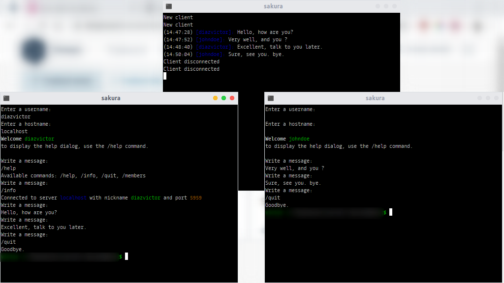

## sdl-net

A simple library for sending and receiving data via networking with Lua-SDL2



To run this example:

```
cd example/
lua server.lua
```

In a separate terminal run `client.lua`

## Dependencies

- Lua 5.1 (or LuaJIT 2.0)
- [Lua-SDL2](https://github.com/tangent128/luasdl2/)

## Documentation

* `sdl_net:new([username, host, port])`: This will create a new client. Arguments:
    * (**string**) `username`: The user name. Default is "johndoe".
    * (**string**) `host`: The Server to be connected to. Default is "localhost".
    * (**number**) `port`: The Server port. Default is 5959.
    _(note: you can also do require('sdl_net')(**ARGUMENTS**)_ 

* `sdl_net:connect()`: Establish the connection to the server.

* `sdl_net:composer(message)`: Compose a message into JSON data. Arguments:
    * (**string**) `message`: The message to be sent.

* `sdl_net:send()`: Send the aftermentioned composite message.

* `sdl_net:disconnect()`: Disconnect from the server.

## Usage

```lua
local sdl_net = require 'sdl_net'
local client = sdl_net:new()

client:connect()
client:composer('Hello World')
client:send()
client:disconnect()
```

### Usage 2:

```lua
local client = require('sdl_net')()

client:connect()
client:composer('Hello World')
client:send()
client:disconnect()
```

## TODO:

* Implement the method to receive the messages (currently they are previewed in a separate script).

## Contributing:

Pull requests are welcome. For major changes, please open an issue first and discuss what you would like to change.

Please make sure to update the tests as appropriate.

## License:

[MIT](LICENSE.md)
